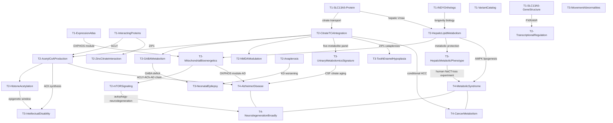

# SLC13A5 Knowledge Wiki — Master Index

**Purpose.** This index provides entry points into a four-tier structured wiki covering SLC13A5 deficiency (DEE25) and the broader biology of the NaCT citrate transporter. The wiki is evidence-graded (✅ Established / 🔶 Emerging / 💡 Speculative / ❓ Unknown) and designed to support manuscript development.

**Total nodes:** 25 (6 Tier 1 + 11 Tier 2 + 6 Tier 3 + 4 Tier 4) plus 6 synthesis files.

---

## Architecture diagram

---

## Tier 1 — Molecular nodes

| Node | Key content | Epistemic status |
|------|-------------|-----------------|
| [[Tier1-Molecular/T1-SLC13A5-GeneStructure]] | Chr17p13.1; intron-exon architecture; PXR/AhR liver induction; TFAM/NRF brain enrichment | ✅ Established |
| [[Tier1-Molecular/T1-SLC13A5-Protein]] | Scaffold/transport domain; elevator mechanism; Na1/Na2 sites; 3:1 Na⁺:citrate³⁻ stoichiometry; cryo-EM 3.04 Å; Km 0.16 mM; dominant-negative mechanism | ✅ Established |
| [[Tier1-Molecular/T1-VariantCatalog]] | Class I (transport-dead, membrane-present) vs Class II (ER-retained); 9,707 DMS variants; UK Biobank r=−0.63; CNV class | ✅ Established |
| [[Tier1-Molecular/T1-ExpressionAtlas]] | Developmental trajectories; cerebrum peaks postnatal year 1 then declines; cerebellum rises; liver highest (~60 RPKM); osteoblast expression | ✅ Established |
| [[Tier1-Molecular/T1-INDYOrthologs]] | Drosophila INDY longevity; mINDY kinetics (Km 49 µM, Vmax 3760 pmol/mg/min); human NAFLD/T2D upregulation; Fan-2021 brain-specific cognitive benefit | ✅ (invertebrate) / 🔶 (mammalian extension) |
| [[Tier1-Molecular/T1-InteractingProteins]] | ACLY (primary ACh acetyl-CoA source); ACSS2 (neuroprotective parallel); SLC25A1 (mitochondrial citrate export); ZIP1 (osteoblast cataplerosis); dominant-negative homodimer | ✅/🔶 per interaction |

---

## Tier 2 — Pathway nodes

| Node | Key content | Epistemic status |
|------|-------------|-----------------|
| [[Tier2-Pathways/T2-CitrateTCAIntegration]] | Conditional NaCT logic; hypoxia/glutamine deprivation gates; five-metabolite TCA perturbation panel | ✅ Established |
| [[Tier2-Pathways/T2-AcetylCoAProduction]] | ACLY→ACh (Gul-Hinc-2026); ACSS2 parallel; nuclear acetyl-CoA for histone acetylation; aging intersection | ✅ (ACLY step) / 🔶 (NaCT upstream) |
| [[Tier2-Pathways/T2-HistoneAcetylation]] | H3K27ac/H3K9ac at synaptic gene loci; critical postnatal window; irreversibility hypothesis; ACSS2 anchor | 💡 Speculative |
| [[Tier2-Pathways/T2-HepaticLipidMetabolism]] | AMPK cascade; 90% lipogenesis reduction in KO; metformin-NaCT; ETG-5773, BI01383298 pharmacology | ✅ (mouse) / 🔶 (human) |
| [[Tier2-Pathways/T2-NMDAModulation]] | Zinc chelation by extracellular citrate; glutamate-site competition; excitability paradox | 💡 Speculative |
| [[Tier2-Pathways/T2-GABAMetabolism]] | Citrate→α-KG→glutamate→GABA; pharmacological response evidence; GABA polarity switch | 🔶 Emerging |
| [[Tier2-Pathways/T2-MitochondrialBioenergetics]] | Ferreira-2026 turquoise WGCNA module; KEGG AD/PD/HD enrichment; TFAM/NRF2 TF enrichment; AMPK-PGC1α | 🔶 Emerging |
| [[Tier2-Pathways/T2-ZincCitrateInteraction]] | Kumar-2021 zinc cytotoxicity rescue; ZIP1 osteoblast cataplerosis; neuronal zinc dynamics | ✅ (cell model) / 🔶 (neuronal) |
| [[Tier2-Pathways/T2-Anaplerosis]] | Glutamine, acetate, ketone body alternatives; KD worsening (Klotz-2016 conflict); ACSS2 bypass | 🔶 Emerging |
| [[Tier2-Pathways/T2-TranscriptionalRegulation]] | PXR (not CAR) mediates PB induction; AhR; TFAM/NRF-like brain enrichment | ✅ (liver) / 🔶 (brain) |
| [[Tier2-Pathways/T2-mTORSignaling]] | AMPK-mTOR axis; DR mimicry; autophagy connection; speculative citrate→lysosomal sensing | 💡 Speculative |
| [[Tier2-Pathways/CONTESTED-CLAIMS]] | KD worsening (CC1); Fan-2021 paradox (CC2); species-capacity confound (CC3); acetazolamide signal (CC4); CSF citrate interpretation (CC5) | Mixed |

---

## Tier 3 — Phenotype nodes

| Node | Key content | Epistemic status |
|------|-------------|-----------------|
| [[Tier3-Phenotypes/T3-NeonatalEpilepsy]] | Seizure onset first days; clonic/tonic; VPA most effective; KD contraindicated; Bailey-2026 gene therapy rescue | ✅ Established |
| [[Tier3-Phenotypes/T3-IntellectualDisability]] | Irreversible despite seizure remission; no genotype-phenotype correlation; static trajectory into adulthood | ✅ Established |
| [[Tier3-Phenotypes/T3-MovementAbnormalities]] | 86% hypotonia onset; Alsemari-2023 spastic quadriplegia (single cohort); white matter hypothesis | ✅/🔶/💡 per feature |
| [[Tier3-Phenotypes/T3-ToothEnamelHypoplasia]] | ZIP1 cataplerosis; paradoxical 4× mineral citrate in KO; micro-CT human DEE25 primary teeth; clinical triad | ✅ Established |
| [[Tier3-Phenotypes/T3-HepaticMetabolicPhenotype]] | Critical gap; predicted metabolic protection; VPA confound; absent hepatic phenotype in records | ❓ Unknown |
| [[Tier3-Phenotypes/T3-UrinaryMetabolomicsSignature]] | Bainbridge-2017 five-metabolite panel; UK Biobank r=−0.63 validation; Lal-2026 VUS disambiguation; Lin-2021 CSF aging biomarker | ✅ Established |

---

## Tier 4 — Disease connection nodes

| Node | Key content | Epistemic status |
|------|-------------|-----------------|
| [[Tier4-DiseaseConnections/T4-AlzheimerDisease]] | Four-layer evidence: OXPHOS co-expression, Fan-2021 cognition, citrate biomarker, ACLY-cholinergic chain | 🔶 Emerging (overall) |
| [[Tier4-DiseaseConnections/T4-MetabolicSyndrome]] | Mouse KO metabolic protection; human NAFLD upregulation; ETG-5773/BI01383298 pharmacology; BBB safety gap | ✅ (mouse) / 🔶 (human) |
| [[Tier4-DiseaseConnections/T4-NeurodegenerationBroadly]] | INDY longevity; OXPHOS module PD/HD enrichment; mTOR-autophagy; selective neuronal vulnerability | 💡 Speculative |
| [[Tier4-DiseaseConnections/T4-CancerMetabolism]] | Conditional NaCT in HCC under hypoxia/glutamine deprivation; zinc-citrate; therapeutic tension | 🔶 Emerging (cell model) |

---

## Synthesis files

| File | Purpose |
|------|---------|
| [[EDGE-MAP]] | Confirmed and inferred edges between nodes; top 10 connection gaps |
| [[HYPOTHESES]] | 12 hypotheses (4 conservative, 4 intermediate, 4 radical) with tests and falsification criteria |
| [[RESEARCH-AGENDA]] | Three-horizon research priorities and manuscript opportunities |
| [[MISSING-LINKS]] | Unresolved wikilinks, unverified citations, speculative claims requiring primary literature |
| [[CONTESTED-CLAIMS]] | Five formally documented contradictions with resolution pathways |

---

## Manuscript files

| File | Purpose |
|------|---------|
| [[JOURNAL-SELECTION]] | Scored journal evaluation and recommendation |
| [[MANUSCRIPT-DRAFT]] | Full perspective manuscript with [WIKI SOURCE:] and [REF:] annotations |
| [[COVER-LETTER]] | Complete cover letter template |
| [[REVIEWER-MEMO]] | Anticipated reviewer objections, experiments likely requested, statistical concerns |

---

## Top-3 hypotheses paragraph (for fast orientation)

The three most intellectually consequential hypotheses in this wiki span conservative to radical.

The most immediately testable — and likely correct — is that the five-metabolite biofluid panel established by Bainbridge-2017 (citrate, succinate, fumarate, malate, and α-ketoglutarate elevated concordantly in plasma, urine, and CSF) will normalize as a unit in DEE25 patients treated with AAV9-SLC13A5 gene therapy, serving as a multi-analyte pharmacodynamic readout for functional NaCT restoration [HYPOTHESES A1]. The Wang-2025 population-scale validation and Bailey-2026 CSF citrate rescue in treated mice make this highly probable; the question is whether normalization is complete and concordant across all five metabolites.

The most scientifically transformative hypothesis — confirmed, it would reshape both the DEE25 therapeutic program and the drug safety calculus for NaCT inhibitors — is that the epigenetic memory of NaCT deficiency during the critical postnatal window is irreversible even after metabolic rescue [HYPOTHESES C2]. If histone acetylation at synaptic gene loci is not established during the window of peak NaCT expression and high citrate-to-ACLY flux in developing neurons, then gene therapy that restores NaCT function after the window may rescue seizures and metabolic biomarkers while leaving the cognitive phenotype permanently impaired. This hypothesis is testable in the Slc13a5 KO mouse model by Bailey-2026's team.

The most consequential for public health — because it would affect millions of people on NaCT inhibitors being developed for metabolic disease — is the U-shaped NaCT-cognition hypothesis [HYPOTHESES C1]: that reducing NaCT activity is cognitively beneficial from a high young-adult baseline (per Fan-2021) but harmful when NaCT activity is already low, as it may be in elderly brains where cerebral SLC13A5 expression has declined for decades (per Ferreira-2026). If the UK Biobank DMS score vs cognition analysis reveals a non-linear relationship, pharmacological NaCT inhibition in elderly patients would require its own age-stratified safety evaluation before large-scale use.
